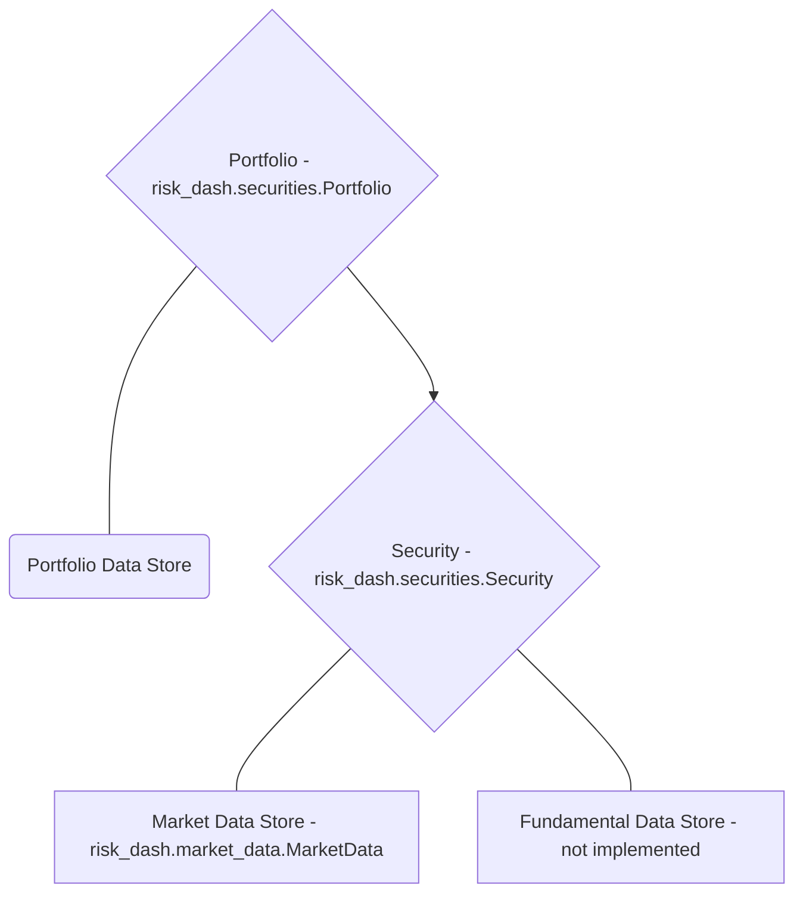

# risk_dash

- [Overview](#overview)
- [Getting Started](#getting-started)
- [Bulding Custom Classes](#building-custom-classes)
- [Simulating Distributions](#simulating-distributions)


## Overview

[risk_dash][1] is a framework to help simplify the data flow for a portfolio of assets and handle market risk metrics at the asset and portfolio level. If you clone the source [repository][1], included is a [Dash](https://plot.ly/dash/) application to be an example of some of the uses for the package. To run the Dash app, documentation is [here](./DashDocumentation.html)

## Getting Started

### Installation

Since the package is in heavy development, to install the package fork or clone the [repository][1] and run `pip install -e risk_dash/` from the directory above your local repository.

To see if installation was sucessful run `python -c 'import risk_dash; print(*dir(risk_dash), sep="\n")'` in the command line, currently the output should match the following:

```bash
$ python -c 'import risk_dash; print(*dir(risk_dash), sep="\n")'
__builtins__
__cached__
__doc__
__file__
__loader__
__name__
__package__
__path__
__spec__
market_data
name
securities
simgen
```

### Quick Start

Now that we have the package installed, let's go through the object workflow to construct a simple long/short equity portfolio.

High level, we need to specify:

1. Portfolio Data
  - Security weights, what securities are in the portfolio
2. Security data
  - Identification data
  - Market data
3. Portfolio/security constructors to handle the above data



Then, once we have the portfolio constructed, we can then create a SimulationGenerator object to create a simulated portfolio distribtution

#### Sourcing Portfolio Data

To have an equity position in your portfolio you need what quantity you ordered, what price, and when you ordered the position. In this example, we'll use the following theoretical portfolio found in `example.csv`:

|Type|Ticker|Ordered Price|Ordered Date|Quantity|
|----|------|-------------|------------|--------|
|Equity|AAPL|179.98|3/9/18|50|
|Equity|AMD|11.7|3/9/18|100|
|Equity|INTC|52.19|3/9/18|-50|
|Equity|GOOG|1160.04|3/9/18|5|

With this example, the portfolio is static, or just one snap shot of the weights at a given time, in practice your portfolio would be dynamically and have a time dimensionality. The Portfolio class could be easily adapted to handle that information to accurately plot historic performance by remarking through time, however, risk metrics looking forward would probably still only want to account for the current positions in the portfolio. Due to this, presently the package only looks at one snap shot in time.

With a portfolio so small, it is very easily stored in a csv and each security can store the reference to the underlying market data independently.


## Building Custom Classes

## Simulating Distributions


[1]: https://github.com/avanoene/risk_dash 'risk_dash'
