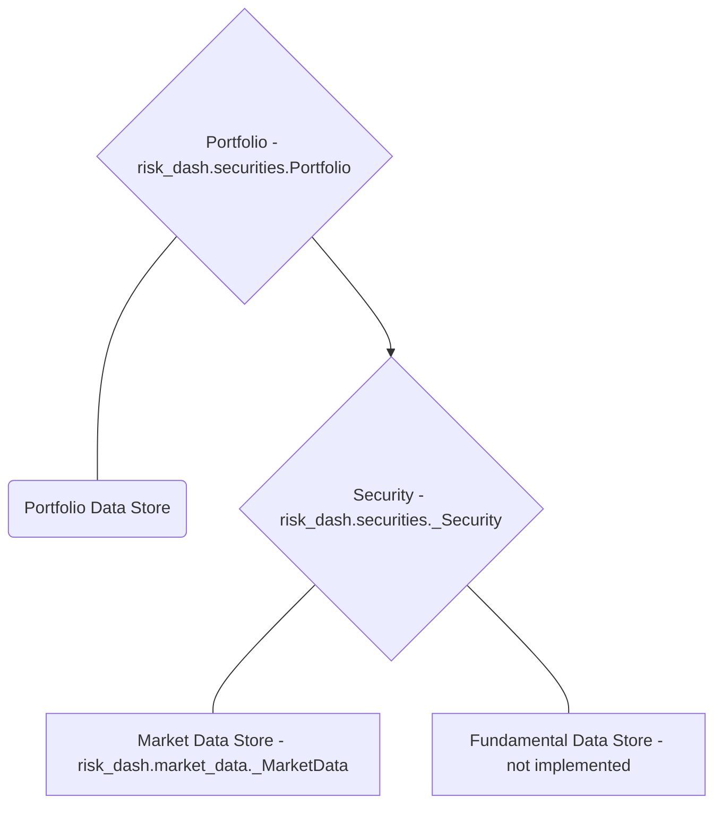

# risk_dash

- [Overview](#overview)
- [Getting Started](#getting-started)
    - [Security data, _Security objects, and creating Security Subclasses](#security-data-security-objects-and-creating-security-subclasses)
    - [Portfolio Data and creating a Portfolio](#portfolio-data-and-creating-a-portfolio)
    - [Calculating Risk Metrics and Using the Portfolio Class](#calculating-risk-metrics-and-using-the-portfolio-class)
        - [Mark the Portfolio](#mark-the-portfolio)
        - [Parametrically Calculating the Value at Risk](#parametrically-calculating-the-value-at-risk)
        - [Simulating the Portfolio](#simulating-the-portfolio)
    - [Summary](#summary)


## Overview

[risk_dash][1] is a framework to help simplify the data flow for a portfolio of assets and handle market risk metrics at the asset and portfolio level. If you clone the source [repository][1], included is a [Dash][dash] application to be an example of some of the uses for the package. To run the Dash app, documentation is [here](dashdocumentation.html)

## Installation

Since the package is in heavy development, to install the package fork or clone the [repository][1] and run `pip install -e risk_dash/` from the directory above your local repository.

To see if installation was successful run `python -c 'import risk_dash; print(*dir(risk_dash), sep="\n")'` in the command line, currently the output should match the following:

```bash
$ python -c 'import risk_dash; print(*dir(risk_dash), sep="\n")'
__builtins__
__cached__
__doc__
__file__
__loader__
__name__
__package__
__path__
__spec__
market_data
name
securities
simgen
```

## Getting Started

Now that we have the package installed, let's go through the object workflow to construct a simple long/short equity portfolio.

High level, we need to specify:

1. Portfolio Data
    - We need to know what's in the portfolio
        - Portfolio weights
        - Types of Assets/Securities
2. Security data
    - We need to know what is important to financially model the security
        - Identification data: Ticker, CUSIP, Exchange
        - Security specific data: expiry, valuation functions
        - Market data: Closing prices, YTM
3. Portfolio/security constructors to handle the above data

To visualize these constructors, the below chart shows how the data will sit:



To do so, we'll need subclasses for the [_Security][3] and [_MarketData][2] classes to model specific types of securities. Currently supported is the Equity subclass. Once we have the portfolio constructed, we will specify and calculate parameters to simulate or look at historic distributions. We'll then create a subclass of [_Simulation][4] and [_RandomGen][5]

### Security data, _Security objects, and creating Security Subclasses

The core of the package is in the _Security and Portfolio objects. Portfolio objects are naturally a collection of Securities, however we want to specify the type of securities that are in the portfolio. Since we're focusing on a long/short equity portfolio we want to create an Equity subclass.

Subclasses of _Security classes must have the following methods:

* valuation(current_price)
* mark_to_market(current_price)
* get_marketdata()

In addition, we want to pass them the associated _MarketData object to represent the security's historic pricing data. To build the Equity subclass, we first want to inherit any methods from the _Security class:

```python
class Equity(_Security):

    def __init__(
            self,
            ticker,
            market_data : md.QuandlStockData,
            ordered_price,
            quantity,
            date_ordered
        ):
        self.name = ticker
        self.market_data = market_data
        self.ordered_price = ordered_price
        self.quantity = quantity
        self.initial_value = ordered_price * quantity
        self.date_ordered = date_ordered
        self.type = 'Equity'

```

To break down the inputs, we want to keep in mind that the goal of this subclass of the _Security object is to provide an interface to model the Equity data.

* ticker is going to be the ticker code for the equity, such as 'AAPL'
* market_data is going to be a subclass of the _MarketData object
* ordered_price is going to be the price which the trade occurred
* quantity for Equity will be the number of shares
* date_ordered should be the date the order was placed

> Note: Currently the implemented _MarketData subclass is QuandlStockData, which is a wrapper for [this Quandl dataset api](https://www.quandl.com/databases/WIKIP). This data is no longer being updated, for current market prices you must create a _MarketData subclass for your particular market data. Information to construct the subclass is on [Building Custom Classes][2].

Required Inputs at the _Security level are intentionally limited, for example if we wanted to create a class for Fixed Income securities, we would want more information than this Equity subclass. An example Bond class might look like this:

```python
class Bond(_Security):
    def __init__(
            self,
            CUSIP,
            market_data,
            expiry,
            coupon,
            frequency,
            settlement_date,
            face_value
        ):
        self.name = CUSIP
        self.market_data = market_data
        self.expiry = expiry
        self.coupon = coupon
        self.frequency = frequency
        self.settlement_date = settlement_date
        self.face_value = face_value
        self.type = 'Bond'
```

Similarly to the Equity subclass, we want identification information, market data, and arguments that will either help in calculating valuation, current returns, or risk measures.

Returning to the Equity subclass, we now need to write the valuation and mark to market methods:

```python
class Equity(_Security):
  # ...
  def valuation(self, price):
      value = (price - self.ordered_price) * self.quantity
      return(value)

  def mark_to_market(self, current_price):
      self.market_value = self.quantity * current_price
      self.marked_change = self.valuation(current_price)
      return(self.marked_change)
```

For linear instruments such as equities, valuation of a position is just the price observed minus the price ordered at the size of the position. `valuation` is then used to pass a hypothetical price into the valuation function, in this case (Price - Ordered) * Quantity, where as `mark_to_market` is used to pass the current EOD price and mark the value of the position. This is an important distinction, if we had a nonlinear instrument such as a call option on a company's equity price, the valuation function would then be:

$$
Value = min\{0, S_{T} - K\}
$$

Where $S_{T}$ is the spot price for the equity at expiry and $K$ is the agreed strike price. Valuation also is dependent on time for option data, however if you were to use a binomial tree to evaluate the option, you would want to use this same value function and discount the value a each node back to time=0.

Our mark to market then would need to make the distinction between this valuation and the current market price for the call option. The mark would then keep track of what the current market value for the option to keep track of actualized returns.

The final piece to creating the Equity subclass is then to add a `get_marketdata()`method. Since we just want a copy of the reference of the `market_data`, we can just inherit the `get_marketdata()` from the _Security class.

The Equity subclass is already implemented in the package, we can create an instance from `risk_dash.securities`. Let's make an instance that represents an order of 50 shares of AAPL, Apple Inc, at close on March 9th, 2018:

```python
>>> from risk_dash.market_data import QuandlStockData
>>> from risk_dash.securities import Equity
>>> from datetime import datetime
>>> apikey = 'valid-quandl-apikey'
>>> aapl_market_data = QuandlStockData(
  apikey = apikey,
  ticker = 'AAPL'
)
>>> aapl_stock = Equity(
  ticker = 'AAPL',
  market_data = aapl_market_data,
  ordered_price = 179.98,
  quantity = 50,
  date_ordered = datetime(2018,3,9)
)
>>> aapl_stock.valuation(180.98) # $1 increase in value
50.0
>>> aapl_stock.mark_to_market(180.98) # Same $1 increase
50.0
>>> aapl_stock.market_value
9049.0
>>> aapl_stock.marked_change
50.0
>>> vars(aapl_stock)
{'name': 'AAPL',
 'market_data': <risk_dash.market_data.QuandlStockData at 0x1147c2668>,
 'ordered_price': 179.98,
 'quantity': 50,
 'initial_value': 8999.0,
 'date_ordered': datetime.datetime(2018, 3, 9, 0, 0),
 'type': 'Equity',
 'market_value': 9049.0,
 'marked_change': 50.0}

```

As we can see `aapl_stock` now is a container that we can use to access it's attributes at the Portfolio level.

> Note: Another important observation is that the Equity subclass will only keep a reference to the underlying QuandlStockData, which will minimize duplication of data. However, at scale, you'd want minimize price calls to your data source, you could then do one call at the Portfolio level then pass a reference to that market_data at the individual level. Then your Equity or other _Security subclasses can share the same _MarketData, you would then just write methods to interact with that data.

Now that we have a feeling for the _Security class, we now want to build a Portfolio that contains the _Security instances.

### Portfolio Data and creating a Portfolio

To iterate on what we said before, an equity position in your portfolio is represented by the quantity you ordered, the price ordered at, and when you ordered or settled the position. In this example, we'll use the following theoretical portfolio found in `portfolio_example.csv`:

|Type|Ticker|Ordered Price|Ordered Date|Quantity|
|----|------|-------------|------------|--------|
|Equity|AAPL|179.98|3/9/18|50|
|Equity|AMD|11.7|3/9/18|100|
|Equity|INTC|52.19|3/9/18|-50|
|Equity|GOOG|1160.04|3/9/18|5|

With this example, the portfolio is static, or just one snap shot of the weights at a given time. In practice, it might be useful to have multiple snapshots of your portfolio, one's portfolio would be changing as positions enter and leave thus having a time dimensionality. The Portfolio class could be easily adapted to handle that information to accurately plot historic performance by remarking through time. This seems more of an accounting exercise, risk metrics looking forward would probably still only want to account for the current positions in the portfolio. Due to this insight, the current Portfolio class only looks at one snap shot in time.

With a portfolio so small, it is very easily stored in a csv and each security can store the reference to the underlying market data independently. As such, there is an included portfolio constructor method in the portfolio class from csv, `construct_portfolio_csv`:

```python
>>> from risk_dash.securities import Portfolio
>>> current_portfolio = Portfolio()
>>> port_dict = current_portfolio.construct_portfolio_csv(
  data_input='portfolio_example.csv',
  apikey=apikey
)
>>> vars(current_portfolio)
{'port': {'AAPL Equity': <risk_dash.securities.Equity at 0x11648b5c0>,
  'AMD Equity': <risk_dash.securities.Equity at 0x116442c50>,
  'INTC Equity': <risk_dash.securities.Equity at 0x1177b75c0>,
  'GOOG Equity': <risk_dash.securities.Equity at 0x1177bc390>}}
>>> vars(current_portfolio.port['AMD Equity'])
{'name': 'AMD',
 'market_data': <risk_dash.market_data.QuandlStockData at 0x11648b2e8>,
 'ordered_price': 11.699999999999999,
 'quantity': 100,
 'initial_value': 1170.0,
 'date_ordered': '3/9/18',
 'type': 'Equity'}
```

At this moment, the `current_portfolio` instance is only a wrapper for it's port attribute, a dictionary containing the securities in the Portfolio object. Soon we'll use this object to mark the portfolio, create a simulation to estimate value at risk, look at the covariance variance matrix to calculate a parameterized volatility measure, and much more.

The `Portfolio` class handles interactions with the portfolio data and the associated securities in the portfolio.  If you have a list of securities you can also just pass the list into the Portfolio instance. The following code creates a portfolio of just the AAPL equity that we created earlier:

```python
>>> aapl_portfolio = sec.Portfolio([aapl_stock])
>>> vars(aapl_portfolio)
{'port': {'AAPL Equity': <risk_dash.securities.Equity at 0x1164b2e80>}}
```

If we want to add a security to this portfolio, we can call the `add_security` method, to remove a security we call the `remove_security` method:

```python
>>> amd_market_data = sec.QuandlStockData(
  ticker='AMD',
  apikey=apikey
)
>>> amd_stock = sec.Equity(
  ticker = 'AAPL',
  market_data = amd_market_data,
  ordered_price = 11.70,
  quantity = 100,
  date_ordered = datetime(2018,3,9)
)
>>> aapl_portfolio.add_security(amd_stock)
>>> aapl_portfolio.port
{'AAPL Equity': <risk_dash.securities.Equity at 0x1164b2e80>,
 'AMD Equity': <risk_dash.securities.Equity at 0x11791cc88>}
>>> aapl_portfolio.remove_security(amd_stock)
>>> aapl_portfolio.port
{'AAPL Equity': <risk_dash.securities.Equity at 0x1164b2e80>}
>>> aapl_portfolio.remove_security(aapl_stock)
>>> aapl_portfolio.port
{}
```

### Calculating Risk Metrics and Using the Portfolio class

Now that we have our `Portfolio` constructed with the securities we have on the book let's use the class to calculate some market risk metrics.

#### Mark the Portfolio

Let's first mark the current portfolio. Since we want to know the current value of the portfolio, the mark method will calculate the value of the portfolio at the current price for each security. The current price is going to be the last known mark, the price at the closest date to today.

> Note: Since the QuandlStockData source hasn't been updated since 3/27/2018, we would expect the last shared date to be 3/27/2018. However, you should use the last shared date as a flag to see if an asset's _MarketData isn't updating. With certain assets, such as Bonds or illiquid securities, marking daily might not make as much sense, so common shared date doesn't mean as much.

```python
>>> current_portfolio.mark()
>>> vars(current_portfolio)
{'port': {'AAPL Equity': <risk_dash.securities.Equity at 0x10f8b2940>,
  'AMD Equity': <risk_dash.securities.Equity at 0x1a1f6b0908>,
  'INTC Equity': <risk_dash.securities.Equity at 0x110538d30>,
  'GOOG Equity': <risk_dash.securities.Equity at 0x110548e10>},
 'market_change': -1476.6999999999989,
 'marked_portfolio': {'AAPL Equity': (8999.0, 8417.0),
  'AMD Equity': (1170.0, 1000.0),
  'INTC Equity': (-2609.5, -2559.5),
  'GOOG Equity': (5800.1999999999998, 5025.5)},
 'date_marked': Timestamp('2018-03-27 00:00:00'),
 'initial_value': 13359.700000000001}

```

The `mark` method now creates the `marked_portfolio` dictionary that stores a tuple, (initial_value, market_value), for every security in the portfolio. We also now can calculate a quick holding period return, `holdingreturn = (current_portfolio.initial_value + current_portfolio.market_change)/current_portfolio.initial_value`

```python
>>> holdingreturn = (current_portfolio.market_change)/current_portfolio.initial_value
>>> print(holdingreturn)
-0.11053391917483169
```

This hypothetical portfolio apparently hasn't performed over the month since inception, it's lost 11%, but let's look at historic returns before we give up on the portfolio. We can call `portfolio.quick_plot` to look at a `matplotlib` generated cumulative return series of the portfolio. If you wanted more control over plotting, you could use the returned `pandas DataFrame. In fact, the current implementation is just using the `pandas DataFrame` method `plot()`:

```python
>>> marketdata = current_portfolio.quick_plot()
```


#### Parametrically Calculating the Value at Risk

As we can see, this portfolio is pretty volatile, but has almost doubled over the last four years. Let's calculate what the portfolio daily volatility over the period based off the percent change by calling `get_port_volatility` using `percentchange` from the `market_data`:
```python
>>> variance, value_at_risk = current_portfolio.set_port_variance(
  key = 'percentchange'
)
>>> volatility = np.sqrt(variance)
>>> print(volatility)
0.01345831069378136
>>> mean = np.mean(current_portfolio.market_data['portfolio'])
>>> print(mean)
0.0007375242310493472
```

We calculated 1.3% daily standard deviation or daily volatility, if the distribution is normally distributed around zero, then we would expect that 95% of the data is contained within approximately 2 standard deviations. We can visually confirm, as well as look to see if there are other distributional aspects we can visually distinguish:

```python
>>> import matplotlib.pyplot as plt
>>> marketdata['portfolio'].plot.hist(bins=20,title='Portfolio Historic Returns')
>>> plt.axvline(temp * 1.96, color='r', linestyle='--') # if centered around zero, then
>>> plt.axvline(-temp * 1.96, color='r', linestyle='--') #
```


This distribution looks highly centered around zero, which could signal kurtosis. This seems indicative of equity data, especially for daily returns. Right now, a good place to start thinking about metric parameterization is to assume normality and independence in daily returns. While this assumption might not be very good or might vary between security to security in the portfolio, which we can account for in simulation or purely using historic returns to calculate risk metrics, we can use this distribution assumption to quickly get a Value at Risk metric over a time horizon.

The default time horizon is 10 days at a 95% confidence level for the `set_port_variance` method, so if we look at the returned `value_at_risk`:

```python
>>> print(value_at_risk)
-0.083413941112170473
```

This value is simply the standard deviation scaled by time, at the critical value specified:

$$
VaR_{t, T} = \sigma * \sqrt{T-t} * Z^{*}_{p = \alpha}
$$

We can interpret this Value at Risk as being the lower bound of the 95% confidence interval for the 10 day distribution. For this portfolio, a loss over 10 days less than 8.3% should occur 2.5% of the time, on average. To get the dollar value of the 10 Day Value at Risk, we would just multiply this percent change by the current portfolio market value.

```python
>>> dollar_value_at_risk = value_at_risk * (current_portfolio.initial_value + current_portfolio.marked_change)
>>> print(dollar_value_at_risk)
-991.20786223592188
```

Similarly, we could interpret as over the a 10 day period, on average, 2.5% of the time there could be an approximate loss over $991.21 dollars for this portfolio. However, this is relying on the assumption that the portfolio is: a) normally distributed, and b) daily returns are serially independent and identically distributed. One way we can go around this is to look at the historic distribution

```python
>>> historic_distribution, historic_var = current_portfolio.historic_var()
>>> print(historic_var)
-0.073051970330112487
```

This is calculated by doing a cumulative sum of returns over each horizon time period, then taking the appropriate percentile of the distribution to get a VaR based on historic prices. This is is smaller than the parametric VaR due to the fact that the distribution looks more right skewed as shown below


This method is fairly simple, however it is based on the assumption that the previous distribution of outcomes is a good representation of the future distribution.

Another way we've implemented to calculate the value at risk is to simulate the portfolio distribution.

#### Simulating the Portfolio

When simulating portfolio returns, one's objective is to correctly specify the portfolio distribution. I consider two major approaches, "bottom-up" and "top-down".

The "bottom-up" approach would include simulating the underlying securities first and then valuing the portfolio through the simulated distributions. The major strength of this method is the ability to easily value the effect of derivative securities on the portfolio. Since one would simulate the derivative's underlier, you could easily then apply the associated value function through the simulated distribution to get the security's profit and loss distribution. Another benefit to this methodology is the analyst has the freedom to change the simulation process at a security level. General Brownian motion might be a good assumption for long/short equity positions, but maybe not as good when simulating yield curves for bonds. Another strength would be the ability to change portfolio weights of securities post simulation, if you simulate a base unit of the security you could then scale the weights accordingly to easily reweigh the portfolio. The biggest challenge to this methodology is to ensure that each simulation value represents the same market environment, meaning that each simulation pull represents the same environment state. While you can potentially do a convolution of the different simulations to get a representative joint distribution of the portfolio, you must ensure that one is capturing the covariance between the securities. For example, equities and bonds have historically had negative correlation to each other, thus a portfolio containing both would potentially have a lower variance than each security separate. To capture that in a simulation one would have to simulate directly from the variance-covariance matrix or do a convolution to combine separate simulations together. While both are possible, and in practice it is probably a preferred methodology, however it's not within the scope of this project.

The "top-down" approach would include aggregating the portfolio a priori and then simulating that distribution. Since the portfolio is made of the member securities, thus the aggregated distribution represents all covariance. While this method gets a little be trickier to handle with derivative securities, since you would need historic market prices per contract and potentially roll adjust through the time period, for securities like equities the assumption seems arguable. The benefit of this method would be having to deal with one simulation and verifying if it represents the underlying distribution vs having several different simulations and verifying if they accurately represent the covariance of constituent securities. The drawback is having less flexibility in the modeling of individual securities within the portfolio. Another drawback is to change the weighting or portfolio members, one must recombine and simulate the new portfolio, which could be computationally intensive depending on the methodology.

Either way, to implement simulation, the _Simulation and _RandomGen class that handle the calculation and generation respectfully. For example, to implement a naive return model, the included NaiveMonteCarlo class represents the following generation function for a single observation:

$$
R_{t} = \phi
$$

Where $\phi$ representing a pull from an imposed distribution. As such, we need to specify that imposed distribution, thus we include the NormalDistribution _RandomGen class to generate a pull. This class is just a wrapper to for numpy.random.normal with the mean and standard deviation specified in the initialization.

Since the aim is to specify the portfolio distribution X days into the future, we want to simulate a cumulative return path through time. Under the assumption that each day is independent, the individual simulation path is then:

$$
P = \sum_{t=1}^{X} R_{t} = \sum_{t=1}^{X} \phi
$$

Now to fully specify the distribution via a Monte Carlo process, we will generate $Y$ paths to represent the underlying $X$ day distribution. To get the mean of the distribution at each $t$ step from 1 to $X$:

$$
E(R_{t}) = \frac{1}{Y} \sum_{i=1}^{Y} P_{t, i}
$$

To get the variance:

$$
Var(R_{t}) = E\left(\left(R_{t} - E(R_{t})\right)^{2}\right) = \frac{1}{Y^{2}} \sum_{i=1}^{Y}\left(P_{t,i} - \bar{P_{t}} \right)
$$

Implemented in the package by the following code, we want to first construct the distribution generator object, the _RandomGen object, then construct a _Simulation object to handle the simulation. Let's do both in using `amd_market_data` to supply the parameters:

```
>>> from risk_dash import simgen as sg
>>> generator = sg.NormalDistribution(
    location = amd_market_data.currentexmean,
    scale = amd_market_data.currentexvol
  )

```
