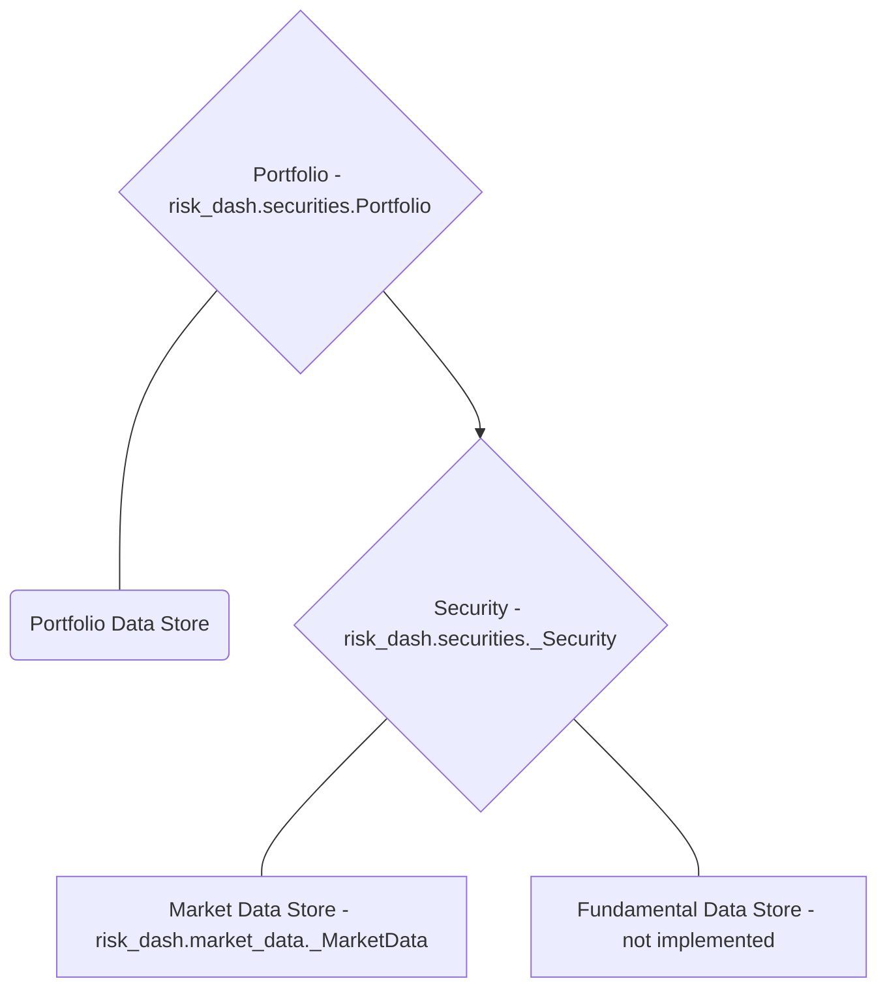

# risk_dash

- [Overview](#overview)
- [Getting Started](#getting-started)
- [Security data, _Security objects, and creating Security Subclasses](#security-data-security-objects-and-creating-security-subclasses)
- [Portfolio Data and creating a Portfolio Object](#portfolio-data-and-creating-a-portfolio-object)
- [Building Custom Classes](#building-custom-classes)
- [Simulating Distributions](#simulating-distributions)

## Overview

[risk_dash][1] is a framework to help simplify the data flow for a portfolio of assets and handle market risk metrics at the asset and portfolio level. If you clone the source [repository][1], included is a [Dash][dash] application to be an example of some of the uses for the package. To run the Dash app, documentation is [here](dashdocumentation.html)

## Getting Started

### Installation

Since the package is in heavy development, to install the package fork or clone the [repository][1] and run `pip install -e risk_dash/` from the directory above your local repository.

To see if installation was successful run `python -c 'import risk_dash; print(*dir(risk_dash), sep="\n")'` in the command line, currently the output should match the following:

```bash
$ python -c 'import risk_dash; print(*dir(risk_dash), sep="\n")'
__builtins__
__cached__
__doc__
__file__
__loader__
__name__
__package__
__path__
__spec__
market_data
name
securities
simgen
```

### Getting Started

Now that we have the package installed, let's go through the object workflow to construct a simple long/short equity portfolio.

High level, we need to specify:

1. Portfolio Data
    - Security weights, what securities are in the portfolio
2. Security data
    - Identification data
    - Market data
3. Portfolio/security constructors to handle the above data



To do so, we'll need subclasses for the [_Security][3] and [_MarketData][2] classes to model specific types of securities. Currently supported is the Equity subclass. Once we have the portfolio constructed, we will specify and calculate parameters to simulate or look at historic distributions. We'll then create a subclass of [_Simulation][4] and [_RandomGen][5]

#### Security data, _Security objects, and creating Security Subclasses

The core of the package is in the _Security and Portfolio objects. Portfolio objects are naturally a collection of Securities, however we want to specify the type of securities that are in the portfolio. Since we're focusing on a long/short equity portfolio we want to create an Equity subclass.

Subclasses of _Security classes must have the following methods:

* valuation(current_price)
* mark_to_market(current_price)
* get_marketdata()

In addition, we want to pass them the associated _MarketData object to represent the security's historic pricing data. To build the Equity subclass, we first want to inherit any methods from the _Security class:

```python
class Equity(_Security):

    def __init__(
            self,
            ticker,
            market_data : md.QuandlStockData,
            ordered_price,
            quantity,
            date_ordered
        ):
        self.name = ticker
        self.market_data = market_data
        self.ordered_price = ordered_price
        self.quantity = quantity
        self.initial_value = ordered_price * quantity
        self.date_ordered = date_ordered
        self.type = 'Equity'

```

To break down the inputs, we want to keep in mind that the goal of this subclass of the _Security object is to provide an interface to model the Equity data.

* ticker is going to be the ticker code for the equity, such as 'AAPL'
* market_data is going to be a subclass of the _MarketData object
* ordered_price is going to be the price which the trade occurred
* quantity for Equity will be the number of shares
* date_ordered should be the date the order was placed

> Note: Currently the implemented _MarketData subclass is QuandlStockData, which is a wrapper for [this Quandl dataset api](https://www.quandl.com/databases/WIKIP). This data is no longer being updated, for current market prices you must create a _MarketData subclass for your particular market data. Information to construct the subclass is [below][2].

Required Inputs at the _Security level are intentionally limited, for example if we wanted to create a class for Fixed Income securities, we would want more information than this Equity subclass. An example Bond class might look like this:

```python
class Bond(_Security):
    def __init__(
            self,
            CUSIP,
            market_data,
            expiry,
            coupon,
            frequency,
            settlement_date,
            face_value
        ):
        self.name = CUSIP
        self.market_data = market_data
        self.expiry = expiry
        self.coupon = coupon
        self.frequency = frequency
        self.settlement_date = settlement_date
        self.face_value = face_value
        self.type = 'Bond'
```

Similarly to the Equity subclass, we want identification information, market data, and arguments that will either help in calculating valuation, current returns, or risk measures.

Returning to the Equity subclass, we now need to write the valuation and mark to market methods:

```python
class Equity(_Security):
  # ...
  def valuation(self, price):
      value = (price - self.ordered_price) * self.quantity
      return(value)

  def mark_to_market(self, current_price):
      self.market_value = self.quantity * current_price
      self.marked_change = self.valuation(current_price)
      return(self.marked_change)
```

For linear instruments such as equities, valuation of a position is just the price observed minus the price ordered at the size of the position. `valuation` is then used to pass a hypothetical price into the valuation function, in this case (Price - Ordered) * Quantity, where as `mark_to_market` is used to pass the current EOD price and mark the value of the position. This is an important distinction, if we had a nonlinear instrument such as a call option on a company's equity price, the valuation function would then be:

$$
Value = min\{0, S_{T} - K\}
$$

Where $S_{T}$ is the spot price for the equity at expiry and $K$ is the agreed strike price. Valuation also is dependent on time for option data, however if you were to use a binomial tree to evaluate the option, you would want to use this same value function and discount the value a each node back to time=0.

Our mark to market then would need to make the distinction between this valuation and the current market price for the call option. The mark would then keep track of what the current market value for the option to keep track of actualized returns.

The final piece to creating the Equity subclass is then to add a `get_marketdata()`method. Since we just want a copy of the reference of the `market_data`, we can just inherit the `get_marketdata()` from the _Security class.

The Equity subclass is already implemented in the package, we can create an instance from `risk_dash.securities`. Let's make an instance that represents an order of 50 shares at close on March 9th, 2018:

```python
>>> import risk_dash.market_data as md
>>> import risk_dash.securities as sec
>>> from datetime import datetime
>>> apikey = 'valid-quandl-apikey'
>>> aapl_market_data = md.QuandlStockData(
  apikey = apikey,
  ticker = 'AAPL'
)
>>> aapl_stock = sec.Equity(
  ticker = 'AAPL',
  market_data = aapl_market_data,
  ordered_price = 179.98,
  quantity = 50,
  date_ordered = datetime(2018,3,9)
)
>>> aapl_stock.valuation(180.98) # $1 increase in value
50.0
>>> aapl_stock.mark_to_market(180.98) # Same $1 increase
50.0
>>> aapl_stock.market_value
9049.0
>>> aapl_stock.marked_change
50.0
>>> vars(aapl_stock)
{'name': 'AAPL',
 'market_data': <risk_dash.market_data.QuandlStockData at 0x1147c2668>,
 'ordered_price': 179.98,
 'quantity': 50,
 'initial_value': 8999.0,
 'date_ordered': datetime.datetime(2018, 3, 9, 0, 0),
 'type': 'Equity',
 'market_value': 9049.0,
 'marked_change': 50.0}

```

As we can see `aapl_stock` now is a container that we can use to access it's attributes at the Portfolio level.

> Note: Another important distinction is that the Equity subclass will only keep a reference to the underlying QuandlStockData, which will minimize duplication of data. However, at scale, you'd want minimize price calls to your data source, you could then do one call at the Portfolio level then pass a reference to that market_data at the individual level.

Now that we have a feeling for the _Security class, we now want to build a Portfolio that contains the _Security instances.

#### Portfolio Data and creating a Portfolio Object

To iterate on what we said before, an equity position in your portfolio is represented by the quantity you ordered, the price ordered at, and when you ordered or settled the position. In this example, we'll use the following theoretical portfolio found in `portfolio_example.csv`:

|Type|Ticker|Ordered Price|Ordered Date|Quantity|
|----|------|-------------|------------|--------|
|Equity|AAPL|179.98|3/9/18|50|
|Equity|AMD|11.7|3/9/18|100|
|Equity|INTC|52.19|3/9/18|-50|
|Equity|GOOG|1160.04|3/9/18|5|

With this example, the portfolio is static, or just one snap shot of the weights at a given time. In practice, it might be useful to have multiple snapshots of your portfolio, one's portfolio would be changing as positions enter and leave thus having a time dimensionality. The Portfolio class could be easily adapted to handle that information to accurately plot historic performance by remarking through time. This seems more of an accounting exercise, risk metrics looking forward would probably still only want to account for the current positions in the portfolio. Due to this insight, the current Portfolio class only looks at one snap shot in time.

With a portfolio so small, it is very easily stored in a csv and each security can store the reference to the underlying market data independently. As such, there is an included portfolio constructor in the portfolio class from csv

```python
>>> current_portfolio = sec.Portfolio()
>>> port_dict = current_portfolio.construct_portfolio_csv(
  data_input='portfolio_example.csv',
  apikey=apikey
)
>>> vars(current_portfolio)
{'port': {'AAPL Equity': <risk_dash.securities.Equity at 0x11648b5c0>,
  'AMD Equity': <risk_dash.securities.Equity at 0x116442c50>,
  'INTC Equity': <risk_dash.securities.Equity at 0x1177b75c0>,
  'GOOG Equity': <risk_dash.securities.Equity at 0x1177bc390>}}
>>> vars(current_portfolio.port['AMD Equity'])
{'name': 'AMD',
 'market_data': <risk_dash.market_data.QuandlStockData at 0x11648b2e8>,
 'ordered_price': 11.699999999999999,
 'quantity': 100,
 'initial_value': 1170.0,
 'date_ordered': '3/9/18',
 'type': 'Equity'}
```

At this moment, the `current_portfolio` instance is


The [`Portfolio` object](/Securities.html#portfolio) is the main portfolio handler for the portfolio data, however, depending on how your data is structured you will want to create a portfolio constructor. If you have a list of securities you can also just pass the list into the Portfolio instance. The following code creates a portfolio of just the AAPL equity that we created earlier:

```python
>>>aapl_portfolio = sec.Portfolio([aapl_stock])
>>>vars(aapl_portfolio)
{'port': {'AAPL Equity': <risk_dash.securities.Equity at 0x1164b2e80>}}
```


## Building Custom Classes

### _MarketData

### _Security

### _RandomGen

### _Simulation

## Simulating Distributions
