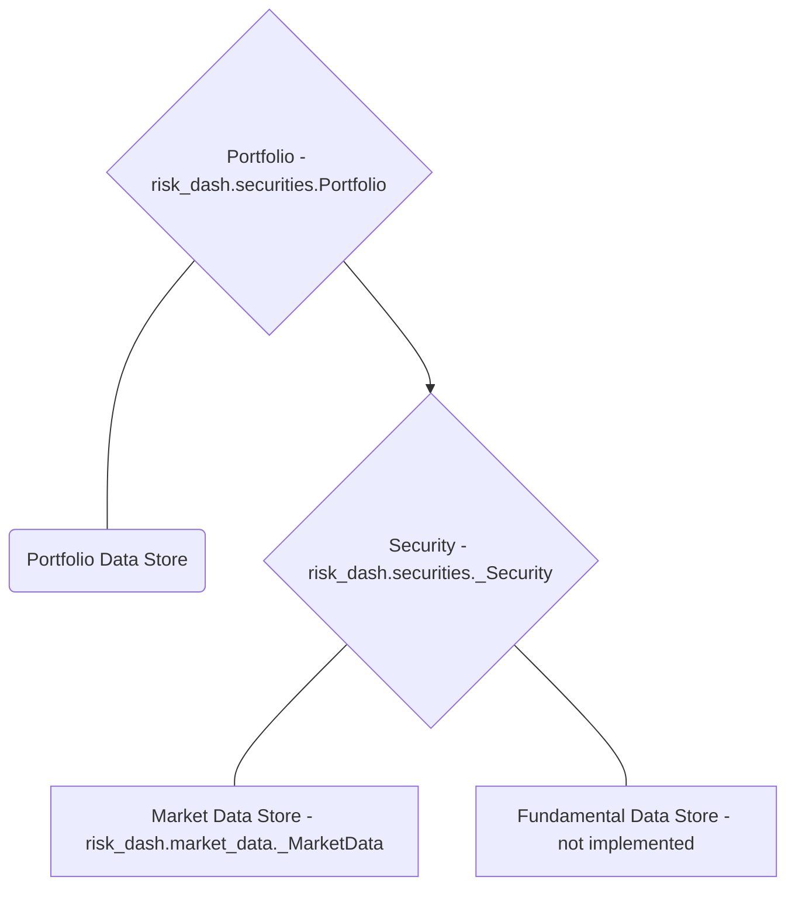

# risk_dash

- [Overview](#overview)
- [Getting Started](#getting-started)
- [Building Custom Classes](#building-custom-classes)
- [Simulating Distributions](#simulating-distributions)

## Overview

[risk_dash][1] is a framework to help simplify the data flow for a portfolio of assets and handle market risk metrics at the asset and portfolio level. If you clone the source [repository][1], included is a [Dash](https://plot.ly/dash/) application to be an example of some of the uses for the package. To run the Dash app, documentation is [here](./DashDocumentation.html)

## Getting Started

### Installation

Since the package is in heavy development, to install the package fork or clone the [repository][1] and run `pip install -e risk_dash/` from the directory above your local repository.

To see if installation was successful run `python -c 'import risk_dash; print(*dir(risk_dash), sep="\n")'` in the command line, currently the output should match the following:

```bash
$ python -c 'import risk_dash; print(*dir(risk_dash), sep="\n")'
__builtins__
__cached__
__doc__
__file__
__loader__
__name__
__package__
__path__
__spec__
market_data
name
securities
simgen
```

### Getting Started

Now that we have the package installed, let's go through the object workflow to construct a simple long/short equity portfolio.

High level, we need to specify:

1. Portfolio Data
    - Security weights, what securities are in the portfolio
2. Security data
    - Identification data
    - Market data
3. Portfolio/security constructors to handle the above data



To do so, we'll need subclasses for the [_Security][3] and [_MarketData][2] classes to model specific types of securities. Currently supported is the Equity class. Once we have the portfolio constructed, we will specify and calculate parameters to simulate or look at historic distributions. We'll then create a subclass of [_Simulation][4] and [_RandomGen][5]

#### Security data, _Security objects, and creating Security Subclasses

The core of the package is in the _Security and Portfolio objects. Portfolio objects are naturally a collection of Securities, however we want to specify the type of securities that are in the portfolio. Since we're focusing on a long/short equity portfolio we want to create a Equity subclass.

Subclasses of _Security classes must have the following methods:

* valuation(current_price)
* mark_to_market(current_price)
* get_marketdata()

In addition, we want to pass them the associated _MarketData object to represent the security's historic pricing data. To build the Equity class, we first want to inherit any methods from the _Security class:

```python
class Equity(_Security):

    def __init__(self, ticker, market_data : md.QuandlStockData, ordered_price, quantity, date_ordered):
        self.name = ticker
        self.market_data = market_data
        self.ordered_price = ordered_price
        self.quantity = quantity
        self.initial_value = ordered_price * quantity
        self.date_ordered = date_ordered
        self.type = 'Equity'

```

To break down the inputs, we want to keep in mind that the goal of this subclass of the _Security object is to provide an interface to model the Equity data.

* ticker is going to be the ticker code for the equity, such as 'AAPL'
* market_data is going to be a subclass of the _MarketData object
* ordered_price is going to be the price which the trade occurred
* quantity for Equity will be the number of shares
* date_ordered should be the date the order was placed

Currently the implemented _MarketData subclass is QuandlStockData, which is a wrapper for [this Quandl dataset api](https://www.quandl.com/databases/WIKIP). This data is no longer being updated, for current market prices you must create a _MarketData subclass for your particular market data. Information to construct the subclass is [below][2].

```python
class Equity(_Security):
  # ...
  def valuation(self, current_price):
      value = (current_price - self.ordered_price) * self.quantity
      return(value)

```

```python
class Equity(_Security):
  # ...
  def mark_to_market(self, current_price):
    self.marketvalue = self.quantity * current_price
    change = (current_price - self.ordered_price) * self.quantity
    return(change)

```

Since the Equity class is already implemented in the package, we can create an instance that represents an order of 50 shares at close on March 9th, 2018. The code to call the instance is as follows:

```python
>>> import risk_dash.market_data as md
>>> import risk_dash.securities as sec
>>> from datetime import datetime
>>> apikey = 'valid-quandl-apikey'
>>> aapl_market_data = md.QuandlStockData(
  apikey = apikey,
  ticker = 'AAPL'
)
>>> aapl_stock = sec.Equity(
  ticker = 'AAPL',
  market_data = aapl_market_data,
  ordered_price = 179.98,
  quantity = 50,
  date_ordered = datetime(2018,3,9)
)
>>> aapl_stock.valuation(180.98) # $1 increase in value
50.0
```

> Note: Another important distinction is that the Equity class will only keep a reference to the underlying QuandlStockData, which will minimize duplication of data. However, at scale, you'd want minimize price calls to your data source, so that could probably be better dealt at the Portfolio level.

#### Portfolio Data and creating a Portfolio Object

To have an equity position in your portfolio you need what quantity you ordered, what price, and when you ordered the position. In this example, we'll use the following theoretical portfolio found in `portfolio_example.csv`:

|Type|Ticker|Ordered Price|Ordered Date|Quantity|
|----|------|-------------|------------|--------|
|Equity|AAPL|179.98|3/9/18|50|
|Equity|AMD|11.7|3/9/18|100|
|Equity|INTC|52.19|3/9/18|-50|
|Equity|GOOG|1160.04|3/9/18|5|

With this example, the portfolio is static, or just one snap shot of the weights at a given time, in practice your portfolio would be dynamically and have a time dimensionality. The Portfolio class could be easily adapted to handle that information to accurately plot historic performance by remarking through time, however, risk metrics looking forward would probably still only want to account for the current positions in the portfolio. Due to this, presently the package only looks at one snap shot in time.

With a portfolio so small, it is very easily stored in a csv and each security can store the reference to the underlying market data independently. As such, there is an included portfolio constructor in the portfolio class from csv

```python
>>> current_portfolio = sec.Portfolio()
>>> port_dict = current_portfolio.construct_portfolio_csv(
  input='.portfolio_example.csv',
  apikey=apikey
)
>>>type(port_dict)
dict
```

The [`Portfolio` object](/Securities.html#portfolio) is main portfolio handler for the portfolio data, however, depending on how your data is structured you will want to create a portfolio constructor. If you have a list of securities you can also just pass the list into the Portfolio instance. The following code creates a portfolio of just the AAPL equity that we created earlier:

```python
>>>aapl_portfolio = sec.Portfolio([aapl_stock])
```


## Building Custom Classes

### _MarketData

### _Security

### _RandomGen

### _Simulation

## Simulating Distributions
